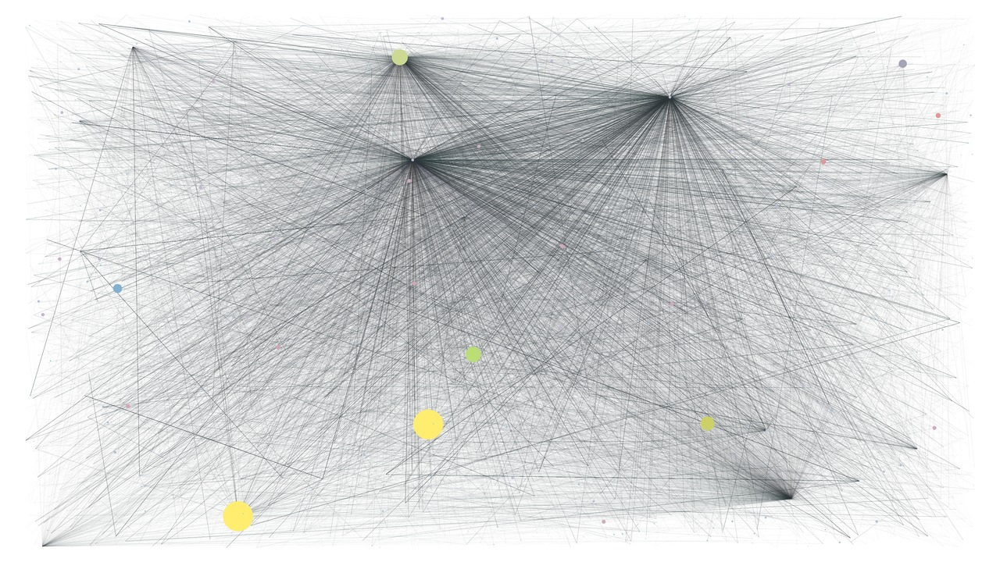

# Ethereum Blockchain Parser

This is a project to parse the Ethereum blockchain from a local geth node. Blockchains are perfect data sets because they contain every transaction ever made on the network. This is valuable data if you want to analyze the network, but Ethereum stores its blockchain in [RLP](https://github.com/ethereum/wiki/wiki/RLP) encoded binary blobs within a series of LevelDB files and these are surprisingly difficult to access, even given the available tools. This project takes the approach of querying a local node via [JSON-RPC](https://github.com/ethereum/wiki/wiki/JSON-RPC), which returns unencoded transactional data, and then moves that data to a mongo database.

## Usage

### Streaming data

To stream blockchain data for real-time analysis, make sure you have both geth and mongo running and start the process with:

        python3 stream.py

Note that this will automatically backfill your mongo database with blocks that it is missing.

### Backfilling your Mongo database

To get data from the blockchain as it exists now and then stop parsing, simply run the following scripts, which are located in the `Scripts` directory. Note that at the time of writing, the Ethereum blockchain has about 1.5 million blocks so this will likely take several hours.

1. Funnel the data from geth to MongoDB:

        python3 preprocess.py

2. Create a series of snapshots of the blockchain through time and for each snapshot, calculate key metrics. Dump the data into a CSV file:

        python3 extract.py

        
## Prerequisites:

Before using this tool to analyze your copy of the blockchain, you need the following things:

### Geth
[Geth](https://github.com/ethereum/go-ethereum/wiki/Geth) is the Go implementation of a full Ethereum node. We will need to run it with the `--rpc` flag in order to request data (**WARNING** if you run this on a geth client containing an account that has ether in it, make sure you put a firewall 8545 or whatever port you run geth RPC on).

A geth instance downloads the blockchain and processes it, saving the blocks as LevelDB files in the specified data directory (`~/.ethereum/chaindata` by default). The geth instance can be queried via RPC with the `eth_getBlockByNumber([block, true])` endpoint (see [here](https://github.com/ethereum/wiki/wiki/JSON-RPC#eth_getblockbynumber)) to get the `X-th` block (with `true` indicating we want the transactional data included), which returns data of the form:

    {
      number: 1000000,
      timestamp: 1465003569,
      ...
      transactions: [
        {
          blockHash: "0x2052ce710a08094b81b5047ea9df5119773ce4b263a23d86659fa7293251055e",
          blockNumber: 1284937,
          from: "0x1f57f826caf594f7a837d9fc092456870a289365",
          gas: 22050,
          gasPrice: 20000000000,
          hash: "0x654ac26084ee6e40767e8735f38274ef5f594454a4d34cfdd70c93aa95be0c64",
          input: "0x",
          nonce: 6610,
          to: "0xfbb1b73c4f0bda4f67dca266ce6ef42f520fbb98",
          transactionIndex: 27,
          value: 201544820000000000
        }
      ]
    }

Since I am only interested in `number`, `timestamps`, and `transactions` for this application, I have omitted the rest of the data, but there is lots of additional information in the block (explore [here](https://etherchain.org/blocks)), including a few Merkle trees to maintain hashes of state, transactions, and receipts (read [here](https://blog.ethereum.org/2015/11/15/merkling-in-ethereum/).

Using the `from` and `to` addresses in the `transactions` array, I can map the flow of ether through the network as time processes. Note that the value, gas, and gasPrice are in Wei, where 1 Ether = 1018 Wei. The numbers are converted into Ether automatically with this tool.

### MongoDB

We will use mongo to essentially copy each block served by Geth, preserving its structure. The data outside the scope of this analysis will be omitted. Note that this project also requires pymongo.

### graph-tool

[graph-tool](https://graph-tool.skewed.de/) is a python library written in C to construct graphs quickly and has a flexible feature set for mapping properties to its edges and vertices. Depending on your system, this may be tricky to install, so be sure and follow their instructions carefully. I recommend you find some way to install it with a package manager because building from source is a pain.

### python3

This was written for python 3.4. Some things will probably break if you try to do this analysis in python 2.

## Workflow

The following outlines the procedure used to turn the data from bytes on the blockchain to data in a CSV file.

### 1. Process the blockchain

Preprocessing is done with the `Crawler` class, which can be found in the `Preprocessing/Crawler` directory. Before instantiating a `Crawler` object, you need to have geth and mongo processes running. Starting a `Crawler()` instance will go through the processes of requesting and processing the blockchain from geth and copying it over to a Mongo collection named `transactions`. Once copied over, you can close the `Crawler()` instance.

### 2. Take a snapshot of the blockchain

A snapshot of the network (i.e. all of the transactions occurring between two timestamps, or numbered blocks in the block chain) can be taken with a `TxnGraph()` instance. This class can be found in the `Analysis` directory. Create an instance with:

    snapshot = TxnGraph(a, b)

where a is the starting block (int) and b is ending block (int). This will load a directed graph of all ethereum addresses that made transactions between the two specified blocks. It will also weight vertices by the total amount of Ether at the time that the ending block was mined and edges by the amount of ether send in the transaction.

To move on to the next snapshot (i.e. forward in time):

    snapshot.extend(c)

where `c` is the number of blocks to proceed.

At each snapshot, the instance will automatically pickle the snapshot and save the state to a local file (disable on instantiation with `save=False`).

#### Drawing an image:

Once `TxnGraph` is created, it will create a graph out of all of the data in the blocks between a and b. An image can be drawn by calling `TxnGraph.draw()` and specific dimensions can be passed using `TxnGraph.draw(w=A, h=B)` where A and B are ints corresponding to numbers of pixels. By default, this is saved to the `Analysis/data/snapshots` directory.

#### Saving/Loading State (using pickle)

The `TxnGraph` instance state can be (and automatically is) pickled with `TxnGraph.save()` where the filename is parameterized by the start/end blocks and is saved. By default, this saves to the `Analysis/data/pickles` directory. If another instance was pickled with a different set of start/end blocks, it can be reloaded with `TxnGraph.load(a,b)`.

### 3: (Optional) Add a lookup table for smart contract transactions

An important consideration when doing an analysis of the Ethereum network is of smart contract addresses. Much ether flows to and from contracts, which you may want to distinguish from simple peer-to-peer transactions. This can be done by loading a `ContractMap` instance. It is recommended you pass the most recent block in the blockchain for `last_block`, as this will find all contracts that were transacted with up to that point in history:

    # If a mongo_client is passed, the ContractMap will scan geth via RPC
    # for new contract addresses starting at "last_block".
    cmap = ContractMap(mongo_client, last_block=90000, filepath="./contracts.p")
    cmap.save()

    # If None is passed for a mongo_client, the ContractMap will automatically
    # load the map of addresses from the pickle file specified in "filepath",
    # ./contracts.p by default.
    cmap = ContractMap()

This will create a hash table of all contract addresses using a `defaultdict` and will save it to a pickle file.

### 4: Aggregate data and analyze

Once a snapshot has been created, initialize an instance of `ParsedBlocks` with a `TxnGraph` instance. This will automatically aggregate the data and save to a local CSV file, which can then be analyzed.
